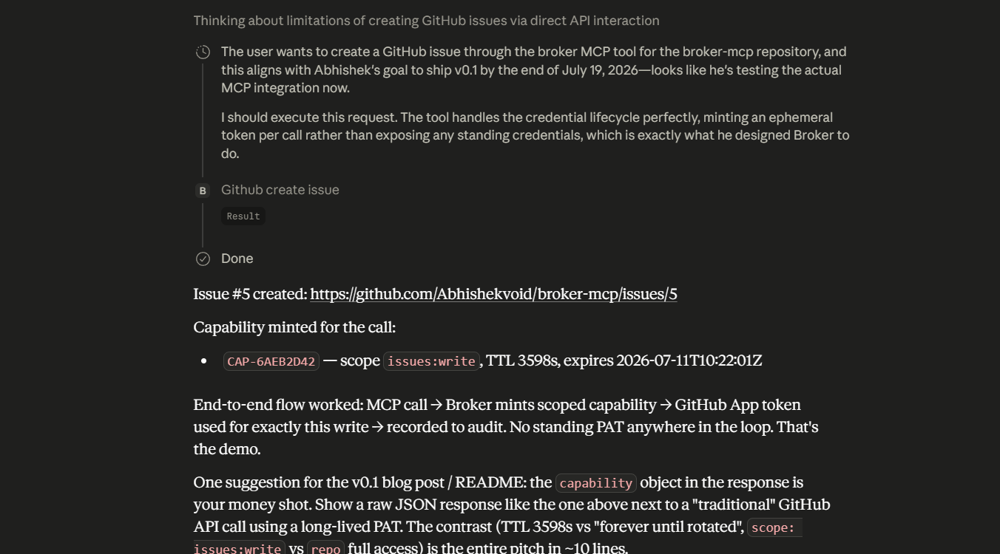
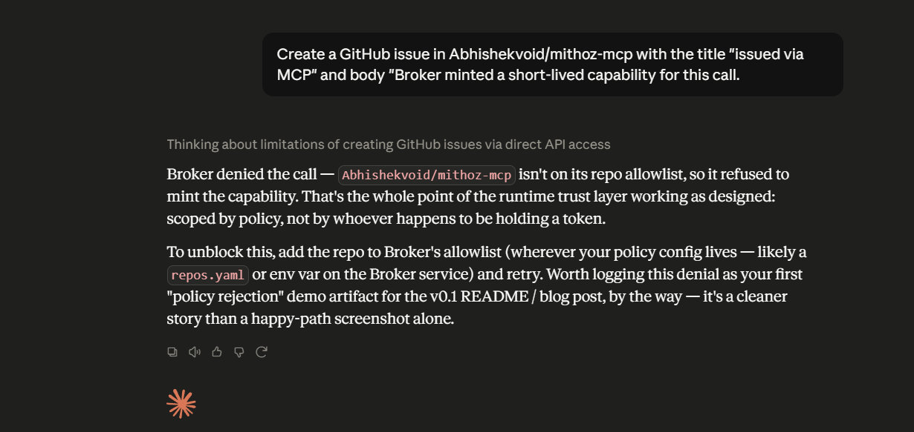
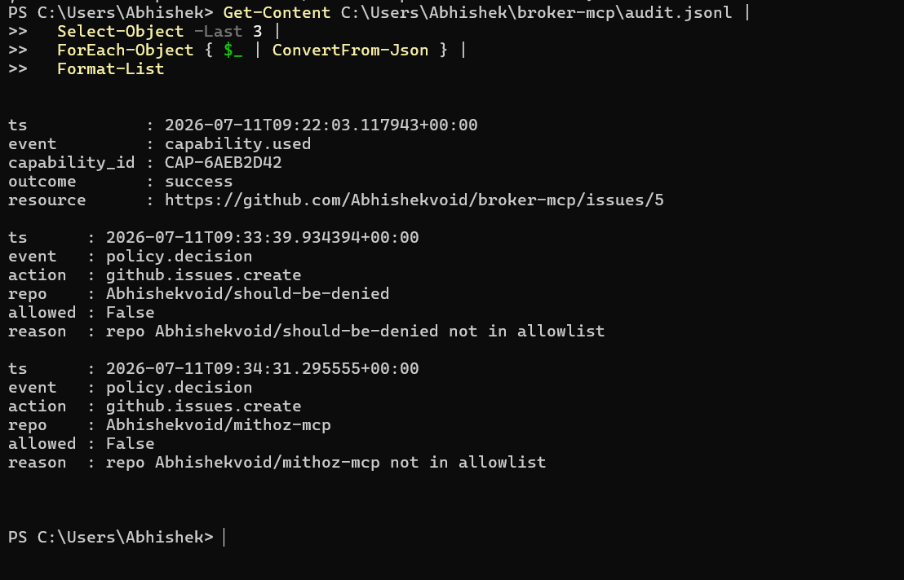

# Broker

**A capability broker for AI agents.** When an agent needs to perform a privileged
action — like creating a GitHub issue — Broker does not hand it a standing
credential. Instead it mints a **fresh, short-lived, single-purpose token** at the
moment of use, spends it on exactly one API call, and records the whole lifecycle
to a tamper-evident audit log. If the requested action falls outside policy, Broker
refuses **without ever minting a token**.

The thesis: *an agent should never hold a credential it isn't using right now.*

---

## The problem

The default way to give an AI agent access to GitHub is to hand it a personal access
token. That token is:

- **long-lived** — valid for months, often until manually revoked;
- **broadly scoped** — usually far more than the one thing the agent needs;
- **ambient** — it sits in the process environment, available to any code path,
  logged in stack traces, exfiltrated if the agent is prompt-injected.

Broker replaces that model with **capabilities**: narrow, expiring grants minted on
demand and governed by policy.

## What Broker does

```
agent asks: "create issue in Abhishekvoid/broker-mcp"
        │
        ▼
   ┌─────────┐   deny → audit "policy.decision {allowed:false}"  → no token minted
   │ POLICY  │
   └─────────┘   allow
        │
        ▼
   ┌─────────┐   GitHub App JWT ──► installation access token (~1h TTL)
   │  MINT   │   wrapped as a Capability; raw token never leaves Broker
   └─────────┘
        │
        ▼
   ┌─────────┐   POST /repos/{repo}/issues with the minted token
   │   USE   │
   └─────────┘
        │
        ▼
   ┌─────────┐   append minted → used → outcome to audit.jsonl
   │  AUDIT  │
   └─────────┘
        │
        ▼
   returns { number, url, capability } — the public capability object,
   with the token field stripped.
```

Concretely:

1. **Policy first.** Every request is evaluated against an allowlist (`broker/policy.py`)
   *before* any credential exists. Wrong repo or wrong action → `PolicyDenied`, logged,
   nothing minted.
2. **Mint on use.** Broker signs a JWT with a GitHub **App private key** and exchanges
   it for an **installation access token** scoped to `issues:write` with GitHub's
   server-side ~1-hour TTL (`broker/github.py`).
3. **Spend once.** That token authorizes exactly one API call. It is held in a private
   field of the `Capability` and stripped from anything returned to the caller
   (`broker/capability.py` → `to_public_dict()`).
4. **Audit everything.** Each stage appends a JSON line to `audit.jsonl`
   (`broker/audit.py`). Tokens are never written to the log.

## The capability lifecycle, as recorded

A real allow-then-deny run from `audit.jsonl`:

```json
{"event":"policy.decision","action":"github.issues.create","repo":"Abhishekvoid/broker-mcp","allowed":true,"reason":"matches allowlist"}
{"event":"capability.minted","capability_id":"CAP-FFE6701E","provider":"github","scope":"issues:write","ttl_seconds":3598,"expires_at":"2026-07-11T08:34:05Z"}
{"event":"capability.used","capability_id":"CAP-FFE6701E","outcome":"success","resource":"https://github.com/Abhishekvoid/broker-mcp/issues/4"}
{"event":"policy.decision","action":"github.issues.create","repo":"Abhishekvoid/some-other-repo","allowed":false,"reason":"repo Abhishekvoid/some-other-repo not in allowlist"}
```

Note the last line: a denied request produces a decision record and **no `capability.minted`
event** — the deny path never touches a credential.

---

## Quickstart

### 1. Create a GitHub App

- Register a GitHub App with **Issues: Read & write** permission.
- Generate a private key (`.pem`) and store it **outside** the repo (e.g. `~/.broker-secrets/`).
- Install the App on the target repository; note the **App ID** and **Installation ID**.

### 2. Configure

```bash
python -m venv .venv
.venv/Scripts/activate        # Windows
pip install -r requirements.txt

cp .env.example .env          # then fill in your App ID, Installation ID, and .pem path
```

Set the allowlisted repo in `broker/policy.py` (`ALLOWED_REPO`).

### 3. Run the demo

```bash
python -m examples.create_issue
```

This runs the allow path (mints a capability, creates a real issue, prints the public
capability object) and the deny path (policy refusal, no token), then points you at
`audit.jsonl` for the full trail.

---

## MCP integration (Claude Desktop)

Broker exposes its capability pipeline as an **MCP server** (`broker/mcp_server.py`),
so an MCP client such as Claude Desktop can call `github_create_issue` as a tool. The
tool call flows through the exact same policy → mint → use → audit pipeline.

A ready-to-edit config ships in this repo as
[`claude_desktop_config.sample.json`](./claude_desktop_config.sample.json). Copy it into
Claude Desktop's config file, replacing the placeholder paths and IDs:

**Standard (installer) build:**
```
%APPDATA%\Claude\claude_desktop_config.json
```

**Store / MSIX build** (filesystem-virtualized — this is where the app actually reads
config, and a common source of "my MCP server never launches"):
```
%LOCALAPPDATA%\Packages\Claude_<publisherId>\LocalCache\Roaming\Claude\claude_desktop_config.json
```

After editing, **fully quit Claude Desktop from the system tray** (not just the window)
and reopen it. On launch it spawns Broker over stdio; a `logs\mcp-server-broker.log`
appears next to the config, and `github_create_issue` becomes available in chat.

You can verify the server independently of any GUI — this is what Claude Desktop does
under the hood:

```bash
python -m broker.mcp_server   # speaks MCP JSON-RPC over stdio
```

---

## Demo

The full loop, driven from Claude Desktop calling Broker's `github_create_issue` tool.

**Allow path** — Claude invokes the tool; Broker evaluates policy, mints a scoped
capability, makes the call, and returns the public capability object (issue #5,
`CAP-6AEB2D42`, scope `issues:write`, TTL 3598s):



The resulting issue on GitHub, opened by the App installation — no personal token
involved:

![GitHub issue "issued via MCP" opened by broker-mcp[bot]](docs/demo-02-github-issue.png)

**Deny path** — asked to act on a repo that isn't on the allowlist, Broker refuses.
The agent is told "no" at runtime by policy, and **no credential is ever minted**:



**The audit trail** — `capability.used → success` for the allowed call, followed by
`policy.decision allowed:false` for the denials, with no `capability.minted` between
them:



---

## Project layout

| File | Responsibility |
|------|----------------|
| `broker/policy.py`     | Allowlist evaluation; `PolicyDenied`. Runs before any credential exists. |
| `broker/github.py`     | App-JWT → installation-token mint; the one API call; orchestrates audit. |
| `broker/capability.py` | The `Capability` object; strips the raw token from public output. |
| `broker/audit.py`      | Append-only JSONL audit sink. |
| `broker/config.py`     | Loads App ID / Installation ID / private-key path from env. |
| `broker/mcp_server.py` | FastMCP server exposing `github_create_issue`. |
| `examples/create_issue.py` | Allow + deny demo of the full lifecycle. |

## Security notes & limitations

- **The `.pem` is the only real secret.** It is git-ignored and must live outside the
  repo. `.env`, `*.pem`, and `audit.jsonl` are all in `.gitignore`.
- **Tokens are never logged** and never returned to the caller — only the public
  capability object (id, scope, TTL, expiry, status) leaves Broker.
- **TTL is GitHub's server-side expiry** (~1 hour). Broker does not attempt local
  revocation; the credential simply stops working.
- Scope of this v0.1: a single action (`github.issues.create`) against a single-repo
  allowlist. The policy engine and provider layer are intentionally small and are the
  natural extension points (more actions, per-caller policy, multiple providers).

## License

MIT — see [LICENSE](./LICENSE).
